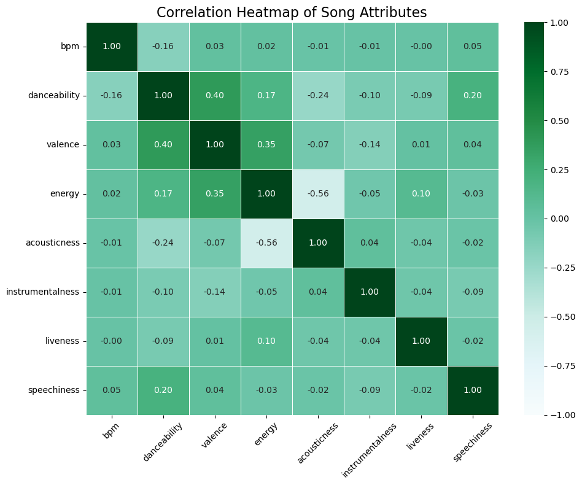
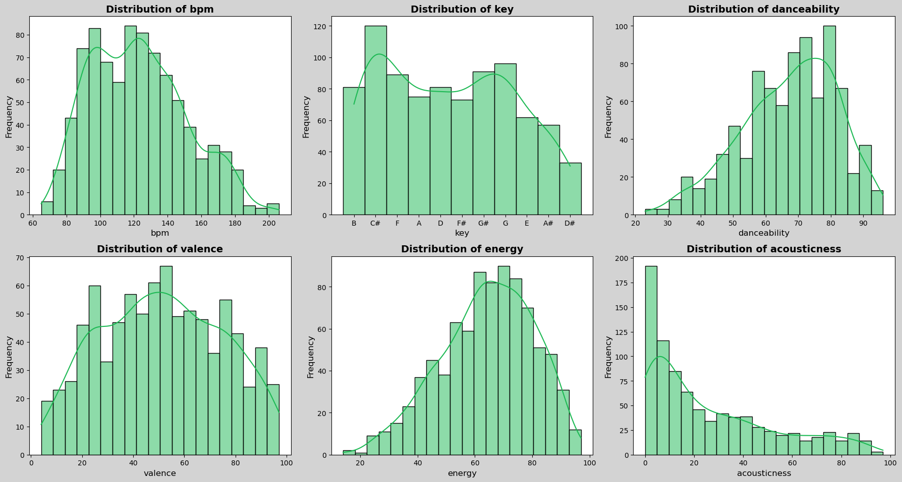
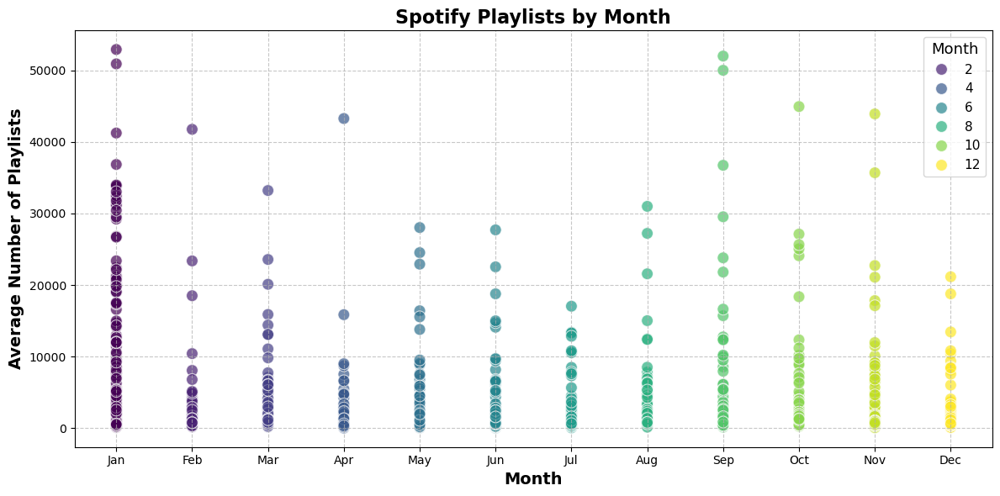
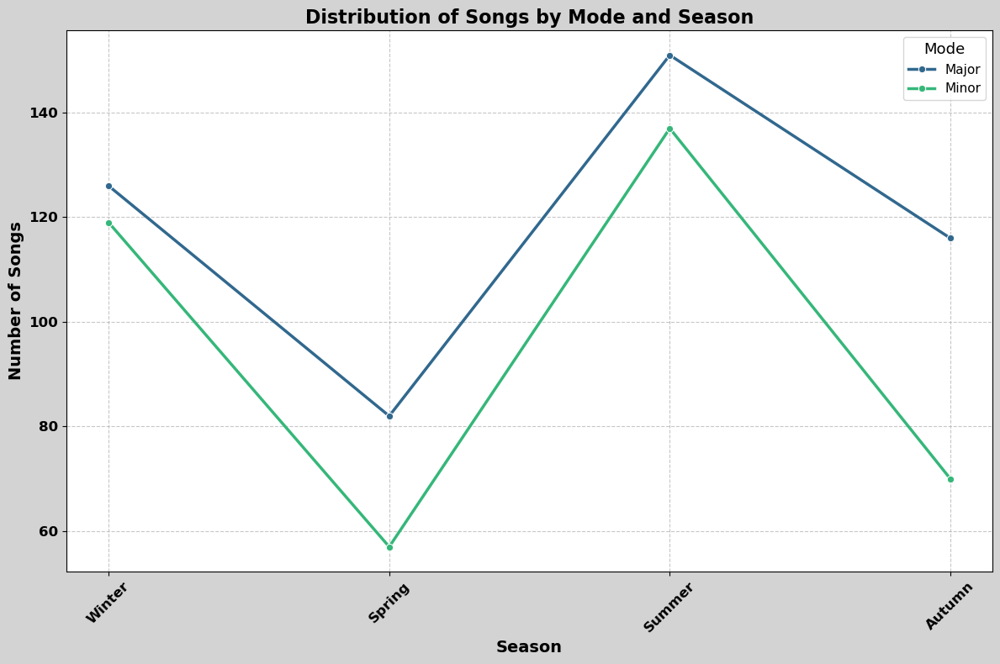

### Analyzing Spotify's 2023 Hits: Key Factors Driving Chart Success
Introduction
What determines a hit song on Spotify in 2023? This project analyzes  the attributes of the year's most popular tracks to understand the factors behind their success. By analyzing these hits, I aim to uncover insights that can guide future music production and strategic marketing.
### Project Overview
**1. Analyzing Hit Attributes**
#### Objective: Identify common characteristics shared among chart-topping songs.

- Descriptive Statistics: Perform statistical analysis on key attributes like mode, key, bpm, and valence.
- Visualization Techniques: Employ histograms, box plots, and bar charts to visualize attribute distributions.
- Correlation Analysis: Utilize a heatmap to examine the relationships between different musical attributes.
- Insight Extraction: Determine the typical attributes that correlate with chart success.

**2. Impact of Positivity on Popularity**
#### Objective: Assess whether songs with higher valence are more likely to feature prominently in playlists.
- Statistical Correlation: Analyze the correlation between valence and the frequency of playlist appearances.
 - Data Visualization: Create scatter plots to illustrate the relationship between these variables.
 - Artist Focus: Examine artists who consistently appear in playlists and their typical song features.
 - Derived Insights: Understand how positivity in music influences listener preferences and playlist inclusions.

**3. Timing and Seasonality of Releases**
#### Objective: Pinpoint the optimal months for releasing songs that are likely to become hits.

- Monthly Aggregation: Compile and analyze data by month to observe trends in playlist appearances.
- Bar Chart Visualization: Use bar charts to represent the distribution of releases over the year.
- Seasonal Insights: Identify strategic release times to maximize listener engagement and chart performance.

**4. Major vs. Minor: Seasonal Preferences**
#### Objective: Explore how the use of major and minor keys varies with seasons.

- Seasonal Distribution Analysis: Study the usage of major versus minor keys across different seasons.
- Comparative Visualization: Utilize bar charts or line graphs to compare key usage.
- Insight Summary: Highlight how seasonal shifts affect musical key preferences and potentially influence listener behavior.

**Conclusion**
#### This analysis highlights:

- Essential Attributes: Successful tracks often feature high BPM, are predominantly in major keys, and exhibit high valence.
- Valence and Marketability: A strong correlation exists between higher valence and increased presence in playlists.
- Strategic Release Timing: Identifying peak months for releases can significantly impact a song’s market success.
#### Recommendations

- For Music Creators: Prioritize energetic, positive tracks and consider timing releases to coincide with peak listener activity months.
- For Marketers: Focus promotional efforts during key release periods and tailor marketing strategies to exploit seasonal listening habits.
- Visualization Enhancement: use advanced graphical representations to clearly communicate key data insights.
- Integrate expert opinions to validate analytical findings and add credibility to the project.

By focusing on a data-driven approach, this project offers actionable insights into the dynamics of musical success on Spotify, providing valuable guidance for stakeholders in the music industry.

